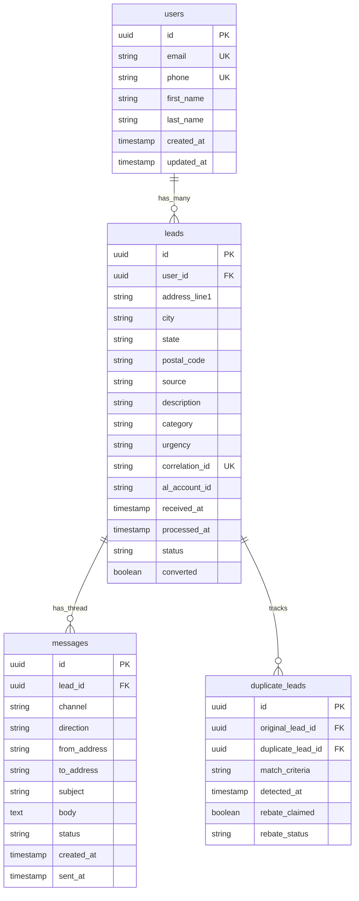

# Ping the Human

A Next.js 15 application for receiving and managing leads from Angi (formerly Angie's List).

## Architecture

```
┌─────────────────────────────────────────────────────────────────────────────────────────┐
│                                                                                         │
│  RECEIVE LEAD              DATA LAYER                         CONTACT                   │
│                                                                                         │
│  ┌──────────────┐         ┌──────────────────┐              ┌──────────────┐           │
│  │    Angi      │         │   Data Mapper    │              │     GPT      │           │
│  │              │   ───►  │                  │     ───►     │              │           │
│  │ POST /v1/    │         │  validate / MoH  │              │   template   │           │
│  │ lead/angi    │         └────────┬─────────┘              └──────┬───────┘           │
│  └──────────────┘                  │                               │                   │
│                                    ▼                               ▼                   │
│  ┌ ─ ─ ─ ─ ─ ─ ┐         ┌──────────────────┐         ┌────────────────────┐          │
│  │   Google    │         │       Zod        │         │   Email Drafting   │          │
│  │             │         │                  │         │                    │          │
│  │   Webhook   │         │ schema validation│         │  Hi [First Name],  │          │
│  └ ─ ─ ─ ─ ─ ─ ┘         └────────┬─────────┘         │                    │          │
│                                    │                   │  We can help with  │          │
│                                    ▼                   │  [Category],       │          │
│                          ┌─────────┴─────────┐        │  we have           │          │
│                          │         │         │        │  availability      │          │
│                          ▼         ▼         ▼        │  today.            │          │
│                       ┌─────┐ ┌────────┐ ┌─────────┐  │                    │          │
│                       │D1/  │ │ SQLite │ │Analytics│  │  CTA: book here /  │          │
│                       │Edge │ │        │ │failed/  │  │       call now     │          │
│                       │NoSQL│ │        │ │success  │  └────────────────────┘          │
│                       └─────┘ └────────┘ └─────────┘                                   │
│                                                                                         │
└─────────────────────────────────────────────────────────────────────────────────────────┘

┌─────────────────────────────┐     ┌─────────────────────────────┐
│   Lead Quality Evaluation   │     │     Marketing Manager       │
│                             │     │                             │
│   • Consistency in format   │     │   • Location                │
│   • Conversion rate         │     │   • Store/dine code         │
│   • Response rate           │     │                             │
└─────────────────────────────┘     └─────────────────────────────┘

┌ ─ ─ ─ ─ ─ ─ ─ ─ ─ ─ ─ ─ ─ ─ ─ ─ ─ ─ ─ ─ ─ ─ ─ ─ ─ ─ ─ ─ ─ ─ ─ ┐
│  BONUS                                                          │
│                                                                  │
│  • Twilio (SMS)              • GPT Email                        │
└ ─ ─ ─ ─ ─ ─ ─ ─ ─ ─ ─ ─ ─ ─ ─ ─ ─ ─ ─ ─ ─ ─ ─ ─ ─ ─ ─ ─ ─ ─ ─ ┘
```

## Features

- **Lead Ingestion**: Receive leads from Angi via webhook
- **User Matching**: Automatically match or create users by email OR phone
- **Duplicate Detection**: Detect duplicate leads by correlation ID for rebate tracking
- **Message Threading**: Track email/SMS conversations per lead
- **Speed-to-Lead Tracking**: Measure time from lead receipt to first outreach

## Tech Stack

- **Next.js 15** with App Router
- **React 19**
- **SQLite** with **Drizzle ORM**
- **Zod** for validation
- **Tailwind CSS**
- **TypeScript**
- **Vitest** for testing

## Getting Started

### Prerequisites

- Node.js 18+
- pnpm

### Installation

```bash
# Install dependencies
pnpm install

# Generate database migrations
pnpm db:generate

# Run migrations
pnpm db:migrate

# Start development server
pnpm dev
```

The app will be available at [http://localhost:3000](http://localhost:3000).

## API Endpoints

### POST /api/v1/lead/angi

Receive leads from Angi webhook.

**Request Body:**
```json
{
  "FirstName": "Bob",
  "LastName": "Builder",
  "PhoneNumber": "5554332646",
  "PostalAddress": {
    "AddressFirstLine": "123 Main St.",
    "AddressSecondLine": "",
    "City": "Indianapolis",
    "State": "IN",
    "PostalCode": "46203"
  },
  "Email": "bob.builder@gmail.com",
  "Source": "Angie's List Quote Request",
  "Description": "I'm Looking for recurring house cleaning services please.",
  "Category": "Indianapolis – House Cleaning",
  "Urgency": "This Week",
  "CorrelationId": "61a7de56-dba3-4e59-8e2a-3fa827f84f7f",
  "ALAccountId": "123456"
}
```

**Response:**
```json
{
  "success": true,
  "leadId": "uuid",
  "userId": "uuid",
  "isDuplicate": false,
  "speedToLeadMs": 42,
  "messageId": "uuid"
}
```

### GET /api/v1/lead

List leads with filtering and pagination.

**Query Parameters:**
- `status` - Filter by status (pending, processed, duplicate)
- `source` - Filter by lead source
- `userId` - Filter by user ID
- `from` - Filter by date (ISO datetime)
- `to` - Filter by date (ISO datetime)
- `limit` - Results per page (default: 50, max: 100)
- `offset` - Pagination offset (default: 0)

**Example:**
```bash
curl "http://localhost:3000/api/v1/lead?status=processed&limit=10"
```

## Database Schema



### Tables

- **users** - Customer profiles (matched by email OR phone)
- **leads** - Service requests from Angi
- **messages** - Email/SMS conversation threads
- **duplicate_leads** - Duplicate tracking for rebates

### View Database

```bash
pnpm db:studio
```

## Testing

```bash
# Run all tests
pnpm test

# Run tests once
pnpm test:run

# Run with coverage
pnpm test:coverage
```

## ngrok Setup (for Angi testing)

To expose your local server to receive Angi webhooks:

```bash
ngrok http 3000
```

Use the generated URL (e.g., `https://xxxx.ngrok.io/api/v1/lead/angi`) as your webhook endpoint in Angi.

## Project Structure

```
├── app/
│   ├── api/v1/lead/        # API routes
│   ├── layout.tsx
│   └── page.tsx
├── db/
│   ├── schema.ts           # Drizzle table definitions
│   ├── index.ts            # Database connection
│   └── migrations/         # SQL migrations
├── docs/
│   └── plan.md             # Project planning documentation
├── lib/
│   ├── schemas.ts          # Zod validation schemas
│   ├── user-matcher.ts     # User matching logic
│   ├── duplicate-detector.ts
│   └── messaging.ts        # Email drafting
└── tests/
    ├── integration/
    └── mocks/
```

## Scripts

| Script | Description |
|--------|-------------|
| `dev` | Start development server |
| `build` | Build for production |
| `start` | Start production server |
| `lint` | Run ESLint |
| `db:generate` | Generate Drizzle migrations |
| `db:migrate` | Run database migrations |
| `db:studio` | Open Drizzle Studio GUI |
| `test` | Run tests in watch mode |
| `test:run` | Run tests once |
| `test:coverage` | Run tests with coverage |

## Backlog

- [ ] Axiom metrics integration
- [ ] UI dashboard for lead management
- [ ] Actual email/SMS sending (Resend, Twilio)
- [ ] Webhook for inbound message tracking
- [ ] Google webhook integration
- [ ] GPT-powered email personalization
