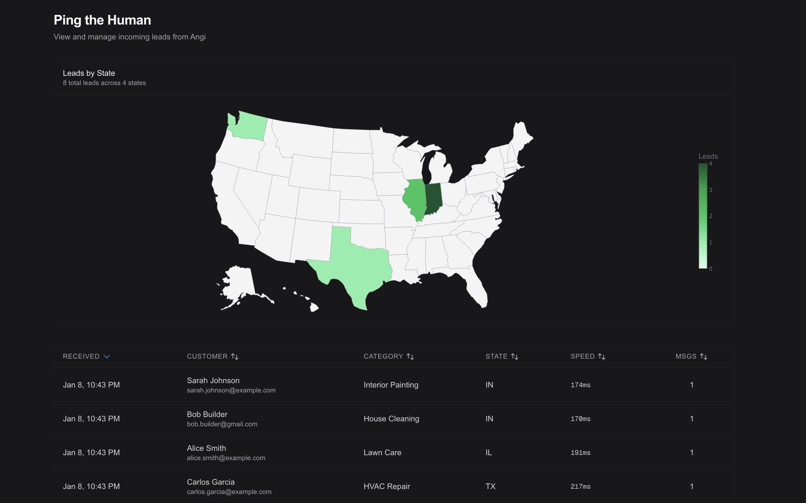
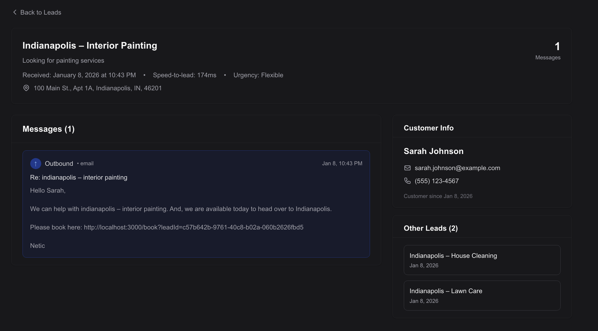

# Ping the Human

**Instant lead response for home service businesses.** When a lead comes in from Angi, we automatically send an email within milliseconds—so you're always first to respond.

## Screenshots



*Dashboard showing leads by state with sortable table*



*Lead detail view with message thread and customer panel*

## How It Works

1. **Lead comes in** → Angi sends a webhook to `/api/v1/lead/angi`
2. **We match the customer** → Find existing user by email or phone, or create new one
3. **Email goes out instantly** → Personalized response with booking link
4. **Track everything** → Speed-to-lead metrics, message history, duplicate detection

## Quick Start

```bash
pnpm install
pnpm db:generate
pnpm db:migrate
pnpm dev
```

Open [http://localhost:3000](http://localhost:3000)

## Tech Stack

- Next.js 15 + React 19
- SQLite with Drizzle ORM
- Tailwind CSS
- TypeScript

## Testing

**Debug Console** — Test individual API requests at [localhost:3000/debug](http://localhost:3000/debug)

**Mock Data** — Load 10 test leads covering edge cases (faulty, duplicates, same person, distinct):

```bash
pnpm test:mock
```

**Unit/Integration Tests:**

```bash
pnpm test           # Watch mode
pnpm test:run       # Single run
pnpm test:coverage  # With coverage
```

## Database

View your data with Drizzle Studio:

```bash
pnpm db:studio
```

## API

### Receive Lead
```
POST /api/v1/lead/angi
```

### List Leads
```
GET /api/v1/lead?status=processed&limit=10
```

### Get Lead Stats
```
GET /api/v1/lead/stats
```

---

*Speed-to-lead matters. Studies show the first responder wins 78% of the time.*
