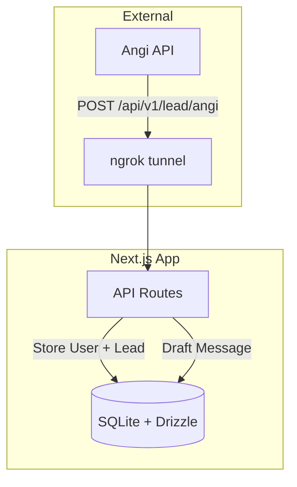
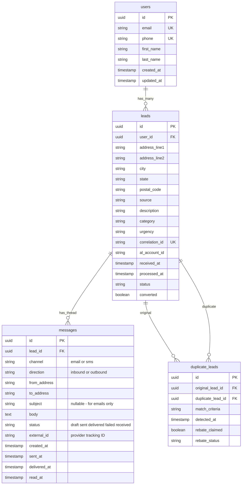

# Lead Management System - Project Plan

> Build a Next.js 15 full-stack application to receive Angi leads, store them in SQLite, auto-draft messages, and detect duplicates for rebates.

## Implementation Status

| Task | Status |
|------|--------|
| Initialize Next.js 15 project with TypeScript, Tailwind, git repo | ✅ Complete |
| Set up Drizzle ORM with SQLite: users, leads, messages, duplicate_leads tables | ✅ Complete |
| Create Zod schemas for Angi payload, query params, and DB inserts | ✅ Complete |
| Implement user find-or-create logic with email OR phone matching | ✅ Complete |
| Implement POST /api/v1/lead/angi with validation, user matching, duplicate detection | ✅ Complete |
| Implement GET /api/v1/lead with filtering, pagination, and computed fields | ✅ Complete |
| Implement duplicate lead tracking and rebate helper functions | ✅ Complete |
| Configure Vitest with MSW mocks and write integration tests | ✅ Complete |
| Connect to GitHub and push | 🔄 In Progress |

---

## Architecture Overview



## Database Schema Design



### Message Threading Model

- All messages for a lead form a single conversation thread, ordered by `created_at`
- First outbound message = intro email/SMS we auto-draft
- Inbound messages = customer replies (email or SMS)
- Subsequent outbound = our follow-up responses
- `converted` on leads tracks if the thread resulted in a booking

### User Matching Logic

When a lead arrives, find or create user by:

1. Check if email matches existing user
2. If not, check if phone matches existing user  
3. If neither, create new user
4. Link lead to user via `user_id`

---

## Project Structure

```
project/
├── app/
│   ├── api/
│   │   └── v1/
│   │       └── lead/
│   │           ├── route.ts          # GET /api/v1/lead
│   │           └── angi/
│   │               └── route.ts      # POST /api/v1/lead/angi
│   ├── globals.css
│   ├── layout.tsx
│   └── page.tsx
├── components/
│   └── ui/                           # shadcn primitives (later)
├── db/
│   ├── schema.ts                     # Drizzle table definitions
│   ├── index.ts                      # Database connection
│   └── migrations/                   # Generated migrations
├── docs/
│   └── plan.md                       # This file
├── lib/
│   ├── schemas.ts                    # All Zod schemas
│   ├── messaging.ts                  # Message drafting (email/SMS threads)
│   ├── duplicate-detector.ts         # Duplicate detection by correlation_id
│   ├── user-matcher.ts               # Find/create user by email OR phone
│   └── utils.ts                      # cn() utility
├── tests/
│   ├── integration/
│   │   └── lead-api.test.ts
│   ├── mocks/
│   │   └── data.ts
│   └── setup.ts
├── drizzle.config.ts
├── vitest.config.ts
├── package.json
├── tsconfig.json
├── tailwind.config.ts
└── .env.example
```

---

## API Endpoints

### POST `/api/v1/lead/angi`

Receive leads from Angi webhook.

**Flow:**
1. Validate incoming Angi payload with Zod
2. Find or create user (email OR phone matching)
3. Check for duplicate via `correlation_id`
4. If duplicate: create `duplicate_leads` record, return rebate info
5. If new: insert lead linked to user, draft email
6. Return: `{ success, leadId, userId, isDuplicate, speedToLead }`

**Request Body (Angi Format):**
```json
{
  "FirstName": "Bob",
  "LastName": "Builder",
  "PhoneNumber": "5554332646",
  "PostalAddress": {
    "AddressFirstLine": "123 Main St.",
    "AddressSecondLine": "",
    "City": "Indianapolis",
    "State": "IN",
    "PostalCode": "46203"
  },
  "Email": "bob.builder@gmail.com",
  "Source": "Angie's List Quote Request",
  "Description": "I'm Looking for recurring house cleaning services please.",
  "Category": "Indianapolis – House Cleaning",
  "Urgency": "This Week",
  "CorrelationId": "61a7de56-dba3-4e59-8e2a-3fa827f84f7f",
  "ALAccountId": "123456"
}
```

**Response:**
```json
{
  "success": true,
  "leadId": "uuid",
  "userId": "uuid",
  "isDuplicate": false,
  "speedToLeadMs": 42,
  "messageId": "uuid"
}
```

### GET `/api/v1/lead`

List leads with filtering and pagination.

**Query Parameters:**
- `status` - Filter by status (pending, processed, duplicate)
- `source` - Filter by lead source
- `userId` - Filter by user ID
- `from` - Filter by date (ISO datetime)
- `to` - Filter by date (ISO datetime)
- `limit` - Results per page (default: 50, max: 100)
- `offset` - Pagination offset (default: 0)

**Response includes:**
- Lead data with user info
- Computed fields: `speedToLeadMs`, `messageCount`, `hasResponse`
- Pagination metadata

---

## Key Implementation Details

### Zod Schemas (`lib/schemas.ts`)

```typescript
// Angi webhook payload validation
const AngiLeadSchema = z.object({
  FirstName: z.string(),
  LastName: z.string(),
  PhoneNumber: z.string(),
  PostalAddress: z.object({
    AddressFirstLine: z.string(),
    AddressSecondLine: z.string().optional(),
    City: z.string(),
    State: z.string(),
    PostalCode: z.string(),
  }),
  Email: z.string().email(),
  Source: z.string(),
  Description: z.string(),
  Category: z.string(),
  Urgency: z.string(),
  CorrelationId: z.string().uuid(),
  ALAccountId: z.string(),
});

// Query params for GET /api/v1/lead
const LeadQuerySchema = z.object({
  status: z.enum(['pending', 'processed', 'duplicate']).optional(),
  source: z.string().optional(),
  from: z.string().datetime().optional(),
  to: z.string().datetime().optional(),
  limit: z.coerce.number().min(1).max(100).default(50),
  offset: z.coerce.number().min(0).default(0),
});
```

### Message Drafting (`lib/messaging.ts`)

```typescript
// Creates first outbound message in the thread
async function draftIntroMessage(lead: Lead, user: User): Promise<Message> {
  const body = `Hello ${user.firstName},

We can help with ${lead.category}. And, we are available today.

Please book here: ${BOOKING_URL}?leadId=${lead.id}

Netic`;
  
  const [message] = await db.insert(messages).values({
    id: crypto.randomUUID(),
    leadId: lead.id,
    channel: 'email',
    direction: 'outbound',
    fromAddress: 'netic@example.com',
    toAddress: user.email,
    subject: `Re: ${lead.category}`,
    body,
    status: 'draft',
    createdAt: new Date(),
  }).returning();
  
  return message;
}
```

### User Matching (`lib/user-matcher.ts`)

```typescript
async function findOrCreateUser(email: string, phone: string, firstName: string, lastName: string) {
  // 1. Try to find by email
  let user = await db.select().from(users).where(eq(users.email, email)).get();
  if (user) return { user, isNew: false };
  
  // 2. Try to find by phone
  user = await db.select().from(users).where(eq(users.phone, phone)).get();
  if (user) return { user, isNew: false };
  
  // 3. Create new user
  const newUser = await db.insert(users).values({
    id: uuid(), email, phone, firstName, lastName, createdAt: new Date()
  }).returning().get();
  
  return { user: newUser, isNew: true };
}
```

### Duplicate Detection (`lib/duplicate-detector.ts`)

- Check if `correlation_id` already exists in `leads` table
- If found: return original lead info + create duplicate record
- Track for rebate claims with `rebate_claimed` boolean and `rebate_status`

### Speed-to-Lead Tracking

- `received_at`: timestamp when lead hits our API
- `processed_at`: timestamp when email draft is created
- `speed_to_lead_ms`: computed as `processed_at - received_at`

---

## NPM Scripts

| Script | Description |
|--------|-------------|
| `dev` | Start development server |
| `build` | Build for production |
| `start` | Start production server |
| `lint` | Run ESLint |
| `db:generate` | Generate Drizzle migrations |
| `db:migrate` | Run database migrations |
| `db:studio` | Open Drizzle Studio GUI |
| `test` | Run tests in watch mode |
| `test:run` | Run tests once |
| `test:coverage` | Run tests with coverage |

---

## ngrok Setup

For exposing locally to Angi:

```bash
ngrok http 3000
# Use the generated URL as webhook endpoint:
# https://xxxx.ngrok.io/api/v1/lead/angi
```

---

## Testing Strategy

1. **Unit tests**: Zod schemas, email drafting, duplicate detection
2. **Integration tests**: Full API route testing with MSW
3. **Test data**: Mock Angi payloads in `tests/mocks/data.ts`

---

## Backlog (Future Enhancements)

- [ ] **Axiom Metrics Integration**: Add `@axiomhq/next` for observability (invocation count, latency, failure rate)
- [ ] **UI Dashboard**: Build frontend to view leads, messages, and analytics
- [ ] **Actual Email/SMS Sending**: Integrate with Resend/SendGrid for email, Twilio for SMS
- [ ] **Webhook for Inbound Messages**: Receive customer replies via email/SMS providers
- [ ] **Rebate Report Export**: Generate CSV/PDF reports of duplicate leads for rebate claims

---

## Design Decisions

### Why SQLite?

- Simple setup, no external database server needed
- Perfect for prototyping and local development
- Easy to migrate to PostgreSQL later if needed

### Why Unified Messages Table?

- Supports both email and SMS in one table
- Enables mixed-channel conversations
- Simplifies analytics (response rate, conversion rate)
- Thread = all messages with same `lead_id`

### Why Email OR Phone Matching?

- Angi may send leads with different email/phone combinations
- Matching by either field catches returning customers
- Creates better user profiles over time

### Duplicate Detection by Correlation ID

- Angi provides unique `CorrelationId` for each lead request
- Same ID = same customer request = duplicate
- Enables rebate claims to Angi for duplicate charges
